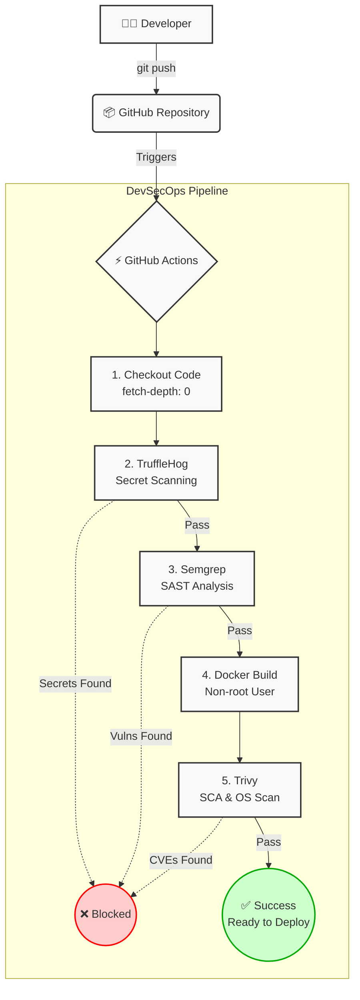

# 🛡️ DevSecOps CI/CD Pipeline 

Este repositorio contiene la implementación de una **Pipeline de Integración Continua (CI) centrada en la Seguridad (DevSecOps)** para una aplicación web Node.js/Express, orquestada mediante GitHub Actions y desplegada en contenedores Docker.

El objetivo de este proyecto es demostrar la integración de controles de seguridad automatizados en las diferentes fases del ciclo de vida del desarrollo de software (SDLC).

## 🏗️ Arquitectura de la Pipeline

La pipeline automatiza las siguientes fases de validación ante cada nuevo `push` en la rama principal:

1. **Secret Scanning:** Detección de credenciales y tokens filtrados en el código.
2. **SAST (Static Application Security Testing):** Análisis estático del código fuente en busca de vulnerabilidades lógicas (ej. XSS, CSRF).
3. **Container Build:** Construcción optimizada de la imagen Docker aplicando el principio de mínimos privilegios (Non-root user).
4. **SCA & Container Security:** Escaneo de dependencias (paquetes npm) y vulnerabilidades a nivel del sistema operativo (CVEs de la imagen base).


 
## 🛠️ Stack Tecnológico y Herramientas de Seguridad

* **Aplicación:** Node.js, Express
* **Contenedores:** Docker, Alpine Linux
* **Orquestador CI/CD:** GitHub Actions
* **Herramientas de Auditoría:**
  * **TruffleHog:** Escaneo profundo del historial de Git para bloquear la subida de secretos (API Keys, tokens).
  * **Semgrep:** Detección de vulnerabilidades en el código (configurado con las reglas de seguridad por defecto para JS).
  * **Trivy:** Escáner de vulnerabilidades (SCA y OS) que bloquea el despliegue si detecta fallos de criticidad `HIGH` o `CRITICAL` en la imagen final.

## 🚀 Cómo ejecutar en local

Si deseas probar la aplicación contenerizada en tu máquina:

1. Clona el repositorio:
```bash
git clone https://github.com/cenii/devsecops-pipeline.git
cd devsecops-pipeline/app
```
2. Construye la imagen Docker:
```bash
docker build -t devsecops-app:local .
```
3. Levanta el contenedor:
```bash
docker run -p 3000:3000 devsecops-app:local
```
4. Accede a la aplicación en: http://localhost:3000

## 🔒 Mejoras de Seguridad Implementadas

Durante el desarrollo de esta pipeline, se auditaron y mitigaron activamente diversas vulnerabilidades:
* Eliminación de credenciales *hardcodeadas*.
* Mitigación de inyecciones XSS forzando respuestas en formato JSON en lugar de HTML plano.
* Implementación de *middlewares* de seguridad contra ataques CSRF (`csurf`, `cookie-parser`).
* Actualización de la imagen base (`node:22-alpine`) y parcheo forzado a nivel de SO (`apk update && apk upgrade --no-cache`) para mitigar vulnerabilidades heredadas (ej. CVE de la librería `zlib`).
* Configuración del contenedor para ejecutarse bajo el usuario sin privilegios `node`.
